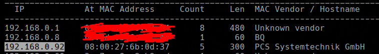

# Hogwarts: Dobby - VulnHub (Walkthrough)


<!--more-->

- **Nombre**: Hogwarts: Dobby
- **URL**: https://www.vulnhub.com/entry/hogwarts-dobby,597/
- **Lanzamiento** Día: 8 Nov 2020
- **Autor**: BLY
- **Serie**: Hogwarts
- **Sistema Operativo**: Linux 🐧
- **Dificultad indicada**: Fácil 🟢
- **Dificultad que encontré**: Fácil 🟢
- **OS usado**: Parrot OS 🦜


## 🌐 Escaneo
Utilizamos "netdiscover" para identificar la IP de la máquina. En mi caso "192.168.0.92".
```
netdiscover -i eth0
```



### ICMP Scanning
Podemos deducir que es una máquina Linux gracias al valor TTL.

| OS | TTL |
| ------ | ---- |
| Linux   | 64 |
| Windows | 128 |


<!-- -->
